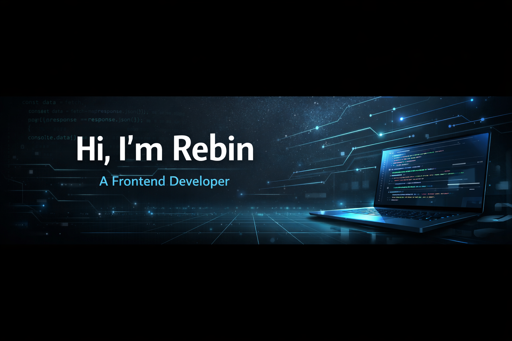

  

---

**Frontend Developer student** aiming to grow into a **Fullstack role**.  
Focused on building **scalable, user-centric web applications** using modern **frontend, backend, cloud and AI technologies**.

---

## 🧠 Background
I previously worked within **social work**, where communication, responsibility and understanding user needs were essential.  
That background strongly influences how I approach development today that is with a clear focus on usability, structure and real-world needs.

---

## 🛠 Tech Stack

### Frontend

### Backend

### Cloud & AI

### Tools & Practices

-111111?style=flat)

---

## 🎯 Focus Areas
- Frontend architecture with **React & TypeScript**  
- State management with **Redux & Zustand**  
- Backend API design and middleware structure  
- Authentication and authorization flows  
- Error handling and data validation  
- Cloud-based solutions using **AWS**  
- AI-powered features using **LangChain**  
- Clean, maintainable, and scalable code  

---

## 📫 Contact
- **GitHub:** https://github.com/KesiiR 
- **LinkedIn:** https://www.linkedin.com/in/rebin-youssef-6a11b0364/

---

⭐ Continuously learning and growing toward a strong fullstack role.

